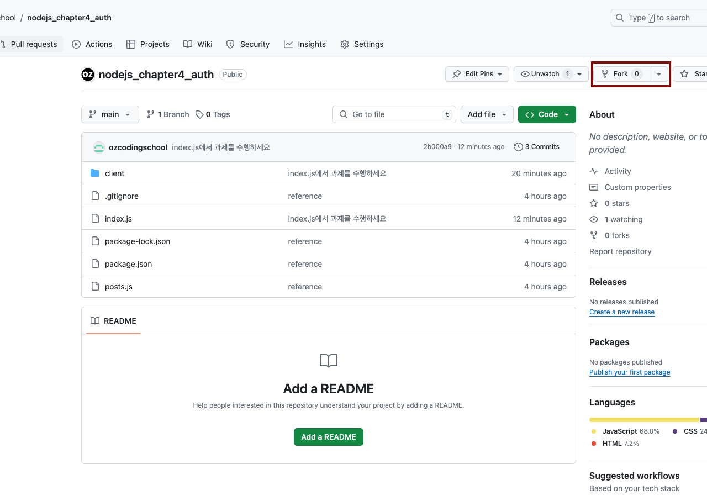
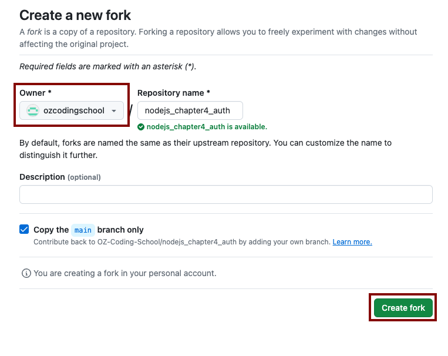
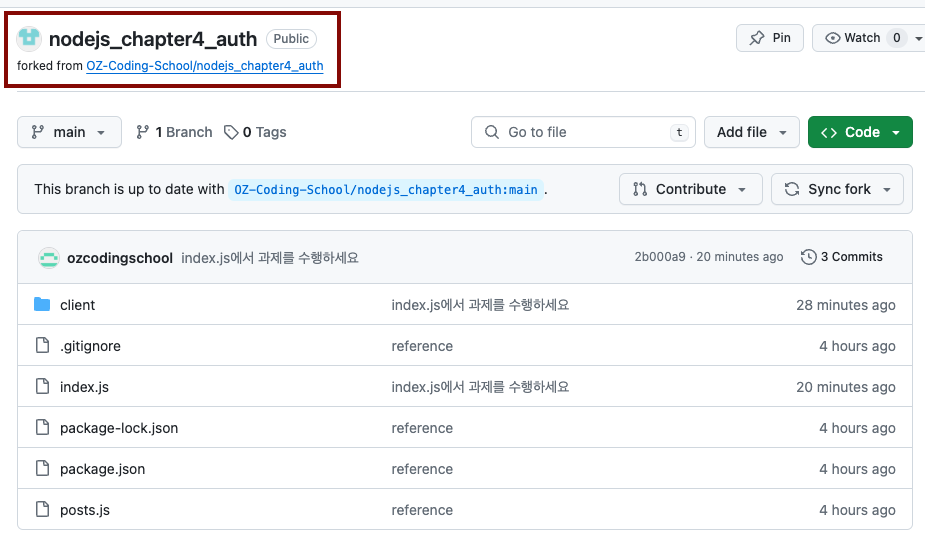
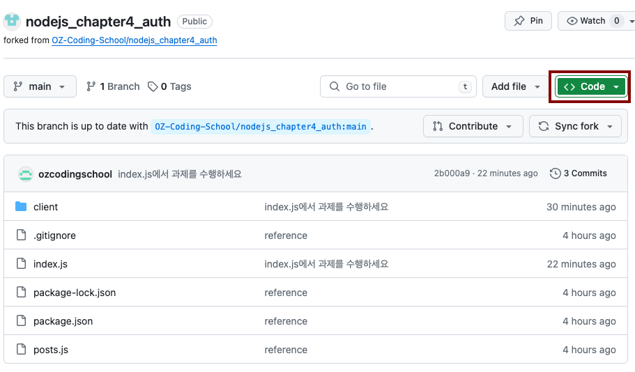
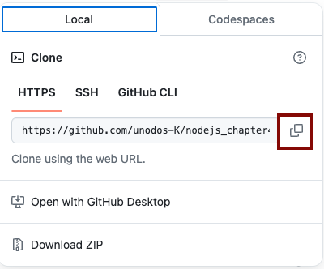

# GitHub 과제 사용 방법
> ## 목차
> [1. Fork](#fork)
> 
> [2. Clone](#clone)
> 
> [3. 과제 수행](#과제-수행)
> 
> [4. Push](#push)
>
> [5. LMS 제출](#lms-제출)

## Fork
1. fork 버튼을 눌러 자신의 Repository로 복사합니다.
  - `fork` 버튼을 클릭하여 `fork` 생성합니다.

  - 생성된 `fork`에서 `Owner`가 자신이 선택되어있는지를 확인합니다.
  - (`Repository name`과 `Description`은 자유롭게 작성해주셔도 괜찮습니다.)
  - create 버튼을 눌러 `fork`합니다.

  - `fork`된 자신의 Repository를 확인합니다.


## Clone
2. 자신의 GitHub Repository에서 clone하여 로컬 환경으로 복사
  - `clone`을 하기 위해 `<> Code` 버튼을 누릅니다. 

  - 드랍다운 내용에서 `Local`의 `복사` 버튼을 눌러 GitHub Repository 주소를 복사합니다.


  - 터미널에서 아래 코드에서 `[복사한 GitHub Repository 주소]` 내용을 위에서 복사한 내용으로 바꾸어 실행합니다.
  ```bash
  git clone [복사한 GitHub Repository 주소]
  ```

## 과제 수행
3. 로컬 환경에서 과제 수행
  - 과제 정보와 과제 요구사항에 맞춰 과제를 진행합니다.

## Push
4. 자신의 GitHub Repository에 push
  - add, commit, push를 활용하여 자신의 GitHub Repository에 수행한 과제를 저장합니다.
   - `add`
   ```bash
   git add [파일 경로 (전체일 경우: .)]
   ```
   - `commit`
   ```bash
   git commit -m "[commit 메세지]"
   ```
   - `push`
   ```bash
   git push [remote name] [branch name]
   ```

## LMS 제출
5. LMS에 GitHub Repository 링크를 복사하여 제출
  - GitHub Repository의 주소를 복사하여 LMS에 제출합니다.